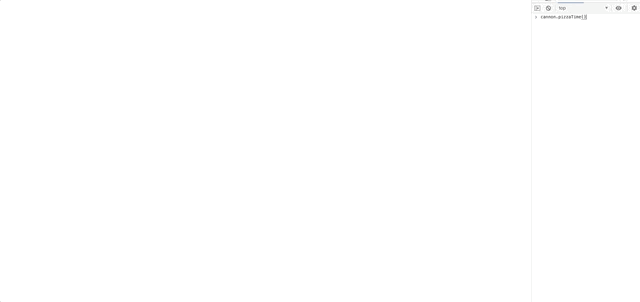
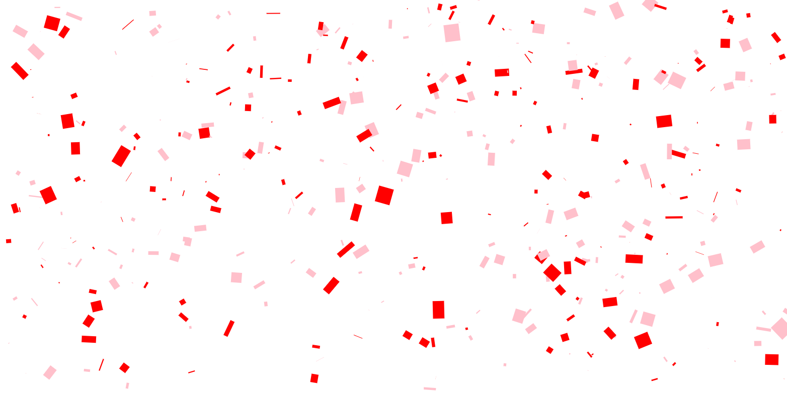

# Easy Confetti!



## How to install

1. Create a canvas with the class `confetti` on it
2. Include the script on your page AFTER you define the body (I am lazy)

## How to use

```js
// Initialize the canvas
ConfettiCannon.initializeCanvas();

// Create instance
const cannon = new ConfettiCannon(configuration);
// Create a buncha sprites in the sprite pool.
// I find 500 is enough. Optional as 100 are made by default
cannon.createSprites(500);
// You don't have to do this, but useful for testing
window.cannon = cannon;

// Invoke this is render all 500 at once!
// Once a piece of confetti has fallen, you have to wait until it hits the ground to shoot more.
cannon.shoot(); // or cannon.pizzaTime()
```

### How to run as an animation

```js
// Render/update loop
let lastFrame = Date.now();
function update() {
  const dt = (Date.now() - lastFrame) * 0.001;
  cannon.update(dt);
  lastFrame = Date.now();
  window.requestAnimationFrame(update);
}

// Kickstart the whole thing. Remember to clean up your RAF when done
update();

// Shot the cannon
cannon.shoot();
```


### How to run as static

If you don't want to establish a render loop, you can also manually update time and have a single "image" of confetti

```js
cannon.shoot(); // Fire the cannon
cannon.update(3); // Simulate three seconds worth of time. Establishes a full scene
```



### Configuration

You can provide the following to the ConfettiCannon constructor to make as many kinds of confetti as you want.
Below are the defaults.

```
{
  maxScale: 3, // Randomization range of width and height
  width: 10, // Base width
  height: 10, // Base Height
  spinFactor: 5, // Randomization range for spin. 0 = no spin
  weight: 50, // How fast confetti falls
  colors: ['orange', 'red', 'blue'] // Potential colors for the confetti pieces
};

```

TODO:
- Targeted canvases
- Multiple cannons per canvas
